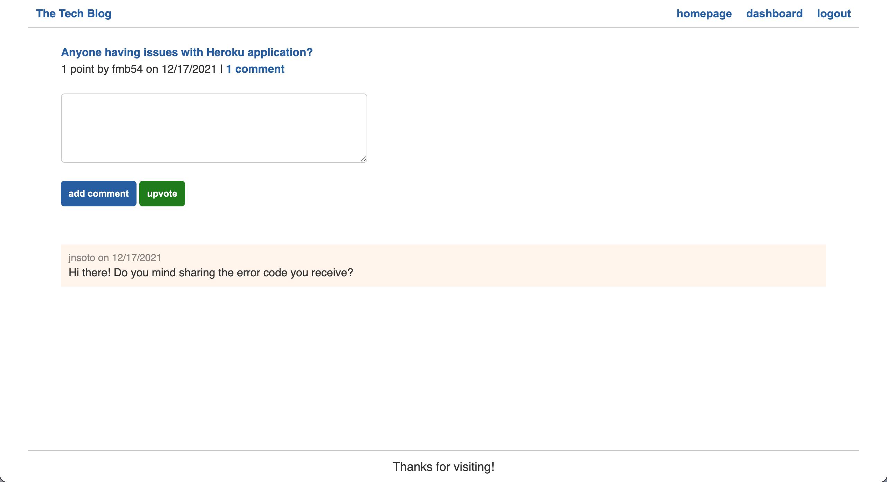

# MVC-Tech-Blog

## Description
This application is a CMS-style blog site where developers can create their own accounts, publish their own blog posts, and comment on other developers’ posts as well.

## Screenshots
Login

Homepage

Create Post

Edit Post

View Post

User Dashboard

## Built With
* HTML
* CSS
* JavaScript
* Node.js
* Sequelize
* Handlebars.js
* MySQL

## Installation
Go to the MVC-Tech-Blog repositiory, then clone the repo onto your machine. Run `n`pm install i` on your terminal once you enter the root directory of this project to install the neccessary dependencies to run the app correctly.

## Usage
When you install the dependencies using npm install on your terminal, run npm start, and the local server will start up on PORT 3001. Use http://localhost:3001/ to view the application on your local server. This application is also available on Heroku, which can be found here: https://aqueous-tundra-44491.herokuapp.com/

The application can then be utilized to create, save and delete user notes.

## Contribution
* Created by Fabricio Bustamante

## Demonstration
Deployed Application URL: https://aqueous-tundra-44491.herokuapp.com/